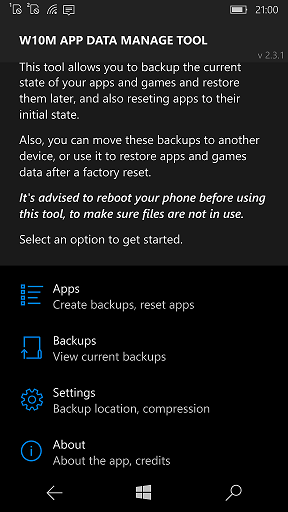
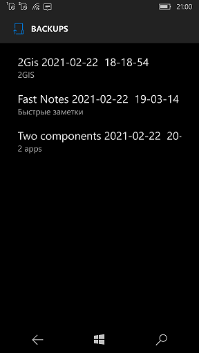

# W10MAppDataManageTool v2.5

My fork of AppDataManageTool 2.2 Beta by Mahdi Ghiasi

## About 
Application Data Manage Tool is a tool for Windows 10 Mobile devices to create backups from current state of apps 
and games, and restore them at a later time, or to another phone, or to your phone after a factory reset.

This tool helps you to create local backup archives from any of your apps and games; 
then you can copy them to your PC and then to any phone so you can restore that archive.

Additionally, you can reset the state of apps, which is almost the same as reinstalling them, but is faster  and also it can be done on some system apps (which you can't reinstall them)

*In order to use this tool, your device must be interop unlocked.*

## Screenshots

## Status
- v2.5.0
- Min. Win. SDK build = 10240.
- Win 11 Desktop experimenting started (no success for Desktop mode yet)

## More Info

More details on xda-developers forum: 
https://forum.xda-developers.com/windows-10-mobile/windows-10-mobile-apps-and-games/app-app-data-manage-tool-t3443623

## References
- https://github.com/MahdiGhiasi/ApplicationDataManageTool/ Original project
- https://github.com/MahdiGhiasi/ Author and Developer of original AppDataManageTool 

## ..
AS IS. No support. RnD only.

## .
[m][e] 2022 -- 2025
